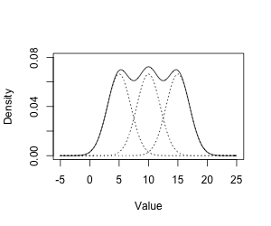

# Note to the evaluator

The data has been generated by asking input from the user for the degree of the data, the number of modes and the number of samples per modes.

Each of the mean vectors was a uniform distribution vector of degree mentioned by user and `mode` number of such vectors

Similarly a temp variable has been fed with a uniform distribution matrix and outer product has been taken for it for generating a semi-definite covariance matrix. `mode` number of such covariances matrices were generated.

Due to this datagen initialization, Nan cases for PDF calculations are imminent in case of small number of samples per mode. Also in case of high number of Modes, the PDF blows up due to the pathological case  

### Emprical observations
Since we're fitting a GMM on a data generated from discrete gaussians, keeping the a finite degree and keeping number of modes as `1` essentially results in the GMM model to have same mean and variance as the data's mean and variance. This validates the `Central Limit Theorem`

Ex:
~~~
Give the degree for the data to be generated
1
Give the number of modes the data must have
1
Give the number of samples per mode
10000
Give log likelihood error tolerance
1e-7
old log likelihood = -30431.210475687018
new log likelihood = -23384.115151655544, Log likelihood error = 7047.095324031474
new log likelihood = -18652.470429843077, Log likelihood error = 4731.644721812467
new log likelihood = -18652.470429843077, Log likelihood error = 0.0
[1.0] - Mixture vector
############### Mean vectors
[array([1.12613959])]
[array([1.13564656])]
############### Covariance vectors
[array([[2.44151078]])]
[array([[2.4298268]])]
~~~

the mean fits to 1.13 when the original value was 1.12
variance fits to 2.44 when it originally was 2.42
for 10,000 samples it's actually within error margin

## Observations by varying the parameters

The options we can vary here are as follows

1. The degree of the data generated
2. The number of distributions from which the data comes from a.k.a the number of modes
3. The total number of samples
4. Stopping Threshold on Log-likelihood

### Varying degree

#### Keeping the number of datagen modes as 1 and samples as 1000

Log likelihood starts of at a lower for a higher degree (more negative value) and saturates similarly.

Ex:
~~~
Degree 1 data:
Give the degree for the data to be generated
1
Give the number of modes the data must have
1
Give the number of samples per mode
1000
Give log likelihood error tolerance
1e-5
old log likelihood = -3627.9932291814475
new log likelihood = -2228.8876021484066, Log likelihood error = 1399.105627033041
new log likelihood = -2106.5841887583906, Log likelihood error = 122.30341339001598
~~~

~~~
Degree 5 data:
Give the degree for the data to be generated
5
Give the number of modes the data must have
1
Give the number of samples per mode
1000
Give log likelihood error tolerance
1e-5
old log likelihood = -11178.812411604467
new log likelihood = -7364.78879678514, Log likelihood error = 3814.023614819327
new log likelihood = -5365.4821671229265, Log likelihood error = 1999.3066296622137
new log likelihood = -5365.4821671229265, Log likelihood error = 0.0
~~~

~~~
Degree 10 data:
Give the degree for the data to be generated
10
Give the number of modes the data must have
1
Give the number of samples per mode
1000
Give log likelihood error tolerance
1e-7
old log likelihood = -55317.644322576096)
new log likelihood = -14654.105238661377, Log likelihood error = 40663.539083914715
new log likelihood = -13072.41655952477, Log likelihood error = 1581.6886791366069
new log likelihood = -13072.41655952477, Log likelihood error = 0.0
~~~

### Varying the number of modes from which data was generated

#### Keeping dagree 1 for simplicity

Like the degree's case, increasing the number of modes keeping all other parameters same resulted in increased negativity of log likelihood

Ex:
~~~
Modes = 5
Give the degree for the data to be generated
1
Give the number of modes the data must have
5
Give the number of samples per mode
1000
Give log likelihood error tolerance
1e-7
old log likelihood = -12917.465741251573
new log likelihood = -10554.519515971733, Log likelihood error = 2362.94622527984030
new log likelihood = -9825.694926644683, Log likelihood error = 728.8245893270505
new log likelihood = -9822.402403758135, Log likelihood error = 3.2925228865478857
new log likelihood = -9822.291710296548, Log likelihood error = 0.11069346158728877
new log likelihood = -9822.2041958629, Log likelihood error = 0.08751443364781153
new log likelihood = -9822.133865531281, Log likelihood error = 0.07033033161860658
new log likelihood = -9822.076482287253, Log likelihood error = 0.05738324402773287
new log likelihood = -9822.029001527662, Log likelihood error = 0.047480759591053356
new log likelihood = -9821.989205738219, Log likelihood error = 0.03979578944381501
new log likelihood = -9821.955458611046, Log likelihood error = 0.03374712717231887
~~~

~~~
Modes = 15
Give the degree for the data to be generated
1
Give the number of modes the data must have
15
Give the number of samples per mode
20
Give log likelihood error tolerance
1e-3
('old log likelihood = -719.7496822264188
('new log likelihood = -651.6662132316054, Log likelihood error = 68.08346899481342
('new log likelihood = -644.2812622179521, Log likelihood error = 7.384951013653335
('new log likelihood = -644.2169251145664, Log likelihood error = 0.06433710338569654
('new log likelihood = -644.1753542678443, Log likelihood error = 0.04157084672203837
('new log likelihood = -644.1469464576376, Log likelihood error = 0.02840781020677241
~~~
Also in case of tightly spaced discrete gaussians, the resulting GMM looks somewhat like in the picture

### Number of samples per mode
Increasing the number of samples of course increases the log likelihood but another interesting observation is that as we increase the number of samples, the resulting GMM is a tighter fit and hence the resulting mean and covariance matrices are relatively closer to generated data's parameters

`Nspm = # Samples per mode`

~~~
Degree 2, Modes 2 and Nspm = 100, stopping condition = 1e-5 log-likelihood error
###############
# Mixture Vector
###############
[0.48482128189611096, 0.5151787181038892]
###############
mean of data and estimated mean
###############
[array([1.58139148, 1.54027249]), array([0.94968997, 1.47118352])]
[array([1.3468298 , 1.28281481]), array([1.02170673, 1.54952194])]
###############
Covariance of data and estimated Covariances
###############
[array([[5.78845139, 6.97744875],
       [6.97744875, 8.45277934]]), array([[5.29875891, 5.61812577],
       [5.61812577, 5.97164681]])]
[array([[4.72435564, 5.61736214],
       [5.61736214, 6.72464121]]), array([[5.34915125, 5.6988152 ],
       [5.6988152 , 6.08410727]])]
~~~

~~~
Degree 2, Modes 2 and Nspm = 1000, stopping threshold = 1e-5
###############
# Mixture Vector
###############
[0.512240106406851, 0.48775989359314864]
###############
mean of data and estimated mean
###############
[array([1.43829706, 1.22900846]), array([1.58443169, 1.46186385])]
[array([1.56007628, 1.42917163]), array([1.52037356, 1.28727445])]
###############
Covariance of data and estimated Covariances
###############
[array([[5.92231568, 4.88800552],
       [4.88800552, 4.14282158]]), array([[5.83665786, 5.18844927],
       [5.18844927, 5.85435566]])]
[array([[6.1989976 , 5.51819924],
       [5.51819924, 6.08868979]]), array([[6.29484358, 5.24580364],
       [5.24580364, 4.4733153 ]])]
~~~

~~~
Degree 2, Modes 2 and Nspm = 10000, stopping threshold = 1e-5
###############
# Mixture Vector
###############
[0.4956425764035712, 0.5043574235964257]
###############
mean of data and estimated mean
###############
[array([1.20532376, 1.66059731]), array([1.60485147, 1.84821011])]
[array([1.20507169, 1.656665  ]), array([1.60941045, 1.84604953])]
###############
Covariance of data and estimated Covariances
###############
[array([[6.81257243, 7.06840109],
       [7.06840109, 7.39414841]]), array([[8.70917977, 6.79974447],
       [6.79974447, 5.80116748]])]
[array([[6.90859419, 7.16672285],
       [7.16672285, 7.49258872]]), array([[8.57960048, 6.7170463 ],
       [6.7170463 , 5.74349414]])]
~~~
### Another interesting observation

In case of all the data coming from a single multivariable gaussian and fitting GMM on it, the mixture parameters will mostly tend zero except one.
and the mean and covariance of the gaussian with significant weight factor will tend to mean and covariance of the data
Ex:
~~~
Give the degree for the data to be generated
1
Give the number of modes the GMM must fit on
4
Give the number of samples per mode
500
Give log likelihood error tolerance
1e-7
[0.14225846446957888, 0.12688877954905153,
0.12229186131937349, 0.6085608946619964]
###############
[array([0.89608278]), array([0.93119688]),
array([0.91137927]), array([1.07517049])]
[array([1.]), array([1.]),
array([1.]), array([1.])]
###############
[array([[1.02955264]]), array([[1.02591006]]),
array([[1.02828189]]), array([[0.98384584]])]
[array([[1.]]), array([[1.]]),
array([[1.]]), array([[1.]])]
~~~

~~~
Give the degree for the data to be generated
2
Give the number of modes the GMM must fit on
3
Give the number of samples per mode
1000
Give log likelihood error tolerance
1e-7
[0.43645718238283865, 0.4876192007520275, 0.07592361686513449]
###############
[array([0.65893227, 2.09403536]), array([1.30031986, 1.85663776]),
array([0.9125905 , 2.52855712])]
[array([1., 2.]), array([1., 2.]), array([1., 2.])]
###############
[array([[0.96233053, 0.04079192],
       [0.04079192, 1.20560115]]), array([[0.88651969, 0.02108025],
       [0.02108025, 0.88409707]]), array([[0.81375477, 0.04797251],
       [0.04797251, 0.43095805]])]
[array([[1., 0.],
       [0., 1.]]), array([[1., 0.],
       [0., 1.]]), array([[1., 0.],
       [0., 1.]])]
~~~
