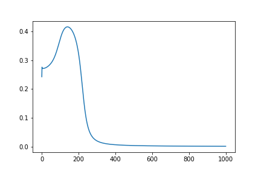

### Observations report for Multi-layer Perceptron

These are the observations tabulated for multilayer perceptron coded using purely numpy. The code includes all the basic 2 bit logic operations (AND, OR, XOR). The training set involves samples generated by adding Gaussian noise of zero mean and user defined variance to both bit pairs and labels. This makes the system more robust to noise and also enables the model to have enough samples to train on.

The configurable parameters in the code are as follows:
1. Number of nodes in the hidden layer
2. Number of training samples per bit pair
3. Standard deviation for Gaussian noise being added
4. Number of Epochs
5. Learning rate
6. Operation which we're trying to train the model on

#### Effect of Number of Hidden nodes

Consider this test case:
- 100 training samples per bit pair
- LR = 0.01
- Epochs = 300
- Std. dev = 0.001

Testing the number of hidden nodes to be 2,4,10 and 40, the following observations were tabulated.

- 2 Hidden nodes ==> Loss = 0.00655 (no overfitting)
- 4 Hidden nodes ==> Loss = 0.00628 (no overfitting)
- 10 Hidden nodes ==> Loss = 0.0024 (no overfitting)
- 50 Hidden nodes ==> Loss = 0.0014 (no overfitting)

Generally when the training samples are less compared to the number of parameters to train, then overfitting may occur

#### Effect of number of Epochs

The number of epochs directly affects the training loss. It saturates after a point but too many epochs can lead to overfitting on the data.

The following plot has been plotted using the following conditions over 1000 Epochs
- Hidden nodes are 4
- 100 training samples per bit pair
- LR = 0.01
- Epochs = 1000
- Std. dev = 0.001
- Operation is XOR

#### Learning rate

Learning rate defines the rate at which the loss converges. Keeping a ridiculously small learning rate leads to very slow convergence of loss.
